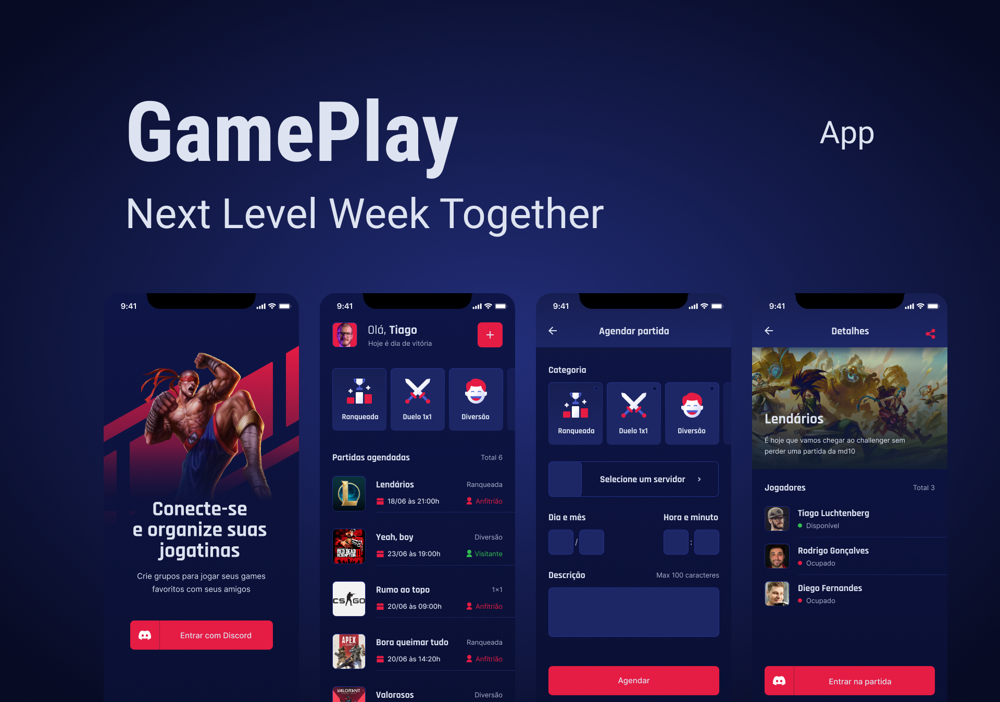

# 👨‍💻 Projeto realizado na trilha React Native da NLW 06
  
<h2>💡 Tecnologias</h2>

<h2>📝 Projeto</h2>
GamePlay é um aplicativo para lhe ajudar a conectar-se e organiza o momento de diversão e jogar com os amigos. Crie grupos para jogar seus games favoritos com seus amigos com esse App que possui autenticação com Discord.
